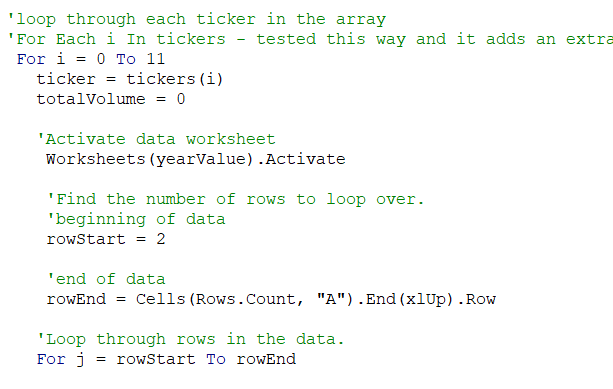

## Overview of Project: 
For this project I helped a financial advisor create a VBA macro to quickly run a trading volume and return analysis on a list of stocks. The code was refactored multiple times to increase efficiency in case a larger dataset is being analyzed in the future. 

## Results: 
2017 was a much better year for clean energy stocks than 2018. DQ was most likely at the top of Steve's parents' list because it was the top performing stock on their clean energy list in 2017. DQ's 2017 return of 199% was significantly higher than any other name on the list. DQ was also the least traded stock on the list. This likely indicates DQ is a smaller company relative to the other tickers on the list. Smaller companies may have lower trading volume makes daily prices more volatile and makes it harder to purchase or sell the stock. Taking these risks into account, it is still clear that DQ was a popular choice for clean energy investors in 2017 and that the entire sector saw significant investor demand. 

2018 was a much more difficult year for the sector. Only two of the 12 stocks on the list generated a positive rate of return for the year. For the companies that were in the green, ENPH and RUN, the returns were once again significantly higher than the broader stock market. Many of the stocks on our list saw a boost in trading volume from 2017 to 2018. The higher trading volume likely indicates the sector saw increased demand. Because of the high returns in 2017 it is probable that investors took notice of the clean energy space and wanted to increase their allocation to companies in the clean energy sector. While returns were significantly lower, the majority of still generated positive returns over the two-year period. Only three names on the list would have had a negative return from 2017-2018. 

I initially set up the macro to run a nested loop which calculated trading volume, the stock's starting price, and the stock's ending price which were then used to calculate the annual return. The data was then output to an analysis results page and the program moved on to the next ticker on the list until each ticker and its corresponding data was output on the results page. 

The analysis originally took 0.94 seconds to calculate the results for the entire list of stocks in 2017, and took 0.98 seconds to calculate the results for the entire list of stocks in 2018

After reviewing the program, I was able to speed up the analysis by making the following changes. First, I moved the row count outside of the loops. This saved time by only calculating the value once instead of having it calculated for each ticker analysis. Second, I created arrays to hold the calculated values for trading volume, starting prices, and ending prices. Creating array for each ticker added flexibility to the code by providing an easier way to access information from each array. Instead of the program immediately outputting all of the data the arrays can be used to output information for a single stock without using up resources. Lastly, I re-wrote the loops in the program as separate loops. Doing so split the calculation section of the macro from the output and formatting section of the macro.

The changes to the macro sped up the analysis and will make it easier to implement the macro on a longer list of stocks. It will also make the macro easier to manipulate in the future if additional features are requested. After making the changes the analysis for 2017 ran in 0.36 seconds, and the analysis for 2018 ran in 0.23 seconds with formatting. 

## Summary: 
### What are the advantages or disadvantages of refactoring code?
#### Advantages of Refactoring
Some advantages of refactoring code include making a program run faster or run more efficiently. Refactoring can also make code easier to read which is helpful if a team is working on a project or the code is being delivered to another developer who will be working on it in the future. Refactoring can also make code more flexible and easier to customize. Maintaining simplicity and avoiding things like magic numbers while making use of variable references can make it easier to add features or change calculations and outputs at a later date. 

#### Disadvantages of refactoring. 
Depending on the problem at hand the advantages of shortening a program or making code simpler could potentially be disadvantages. Writing code with multiple calculations in a single step, or decreasing the number of variables, etc. by combining data could be problematic if a bug comes up when the code is being worked on. It's also possible that simplicity without the right layout may decrease flexibility rather than increase it. For example, conditionals which use absolute references rather than dynamic references will be more difficult to change. This would make it more difficult to add features or re-use portions of the code for another project. 

### How do these pros and cons apply to refactoring the original VBA script?
In the original script we were able to complete the task for a small number of inputs. The program became slower as we added more inputs to loop through. It's possible that the code would not scale well for larger projects and may take a long-time to run or encounter resource issues in Excel. Additionally, the original code was performing calculations multiple times for each ticker, such as counting the rows of data in each loop, which did not need to be recalculated. Removing these redundancies helped speed up the analysis. 

On the negative side, the code may not be as flexible as it could be. The exact number of inputs for tickers and the exact size of the arrays were hard coded into the program. Providing that data to the program may make it run faster, but it also makes it more cumbersome to add stocks to the analysis. For example, it would take a lot of time to type in the tickers of 100 stocks into out ticker array rather than writing a code that could potentially read that data from a worksheet.

